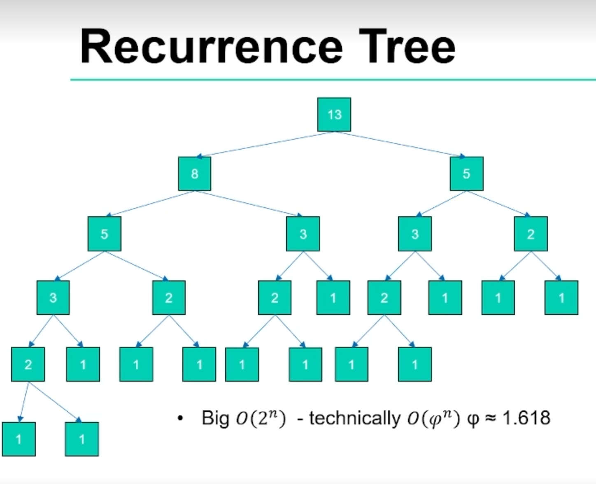
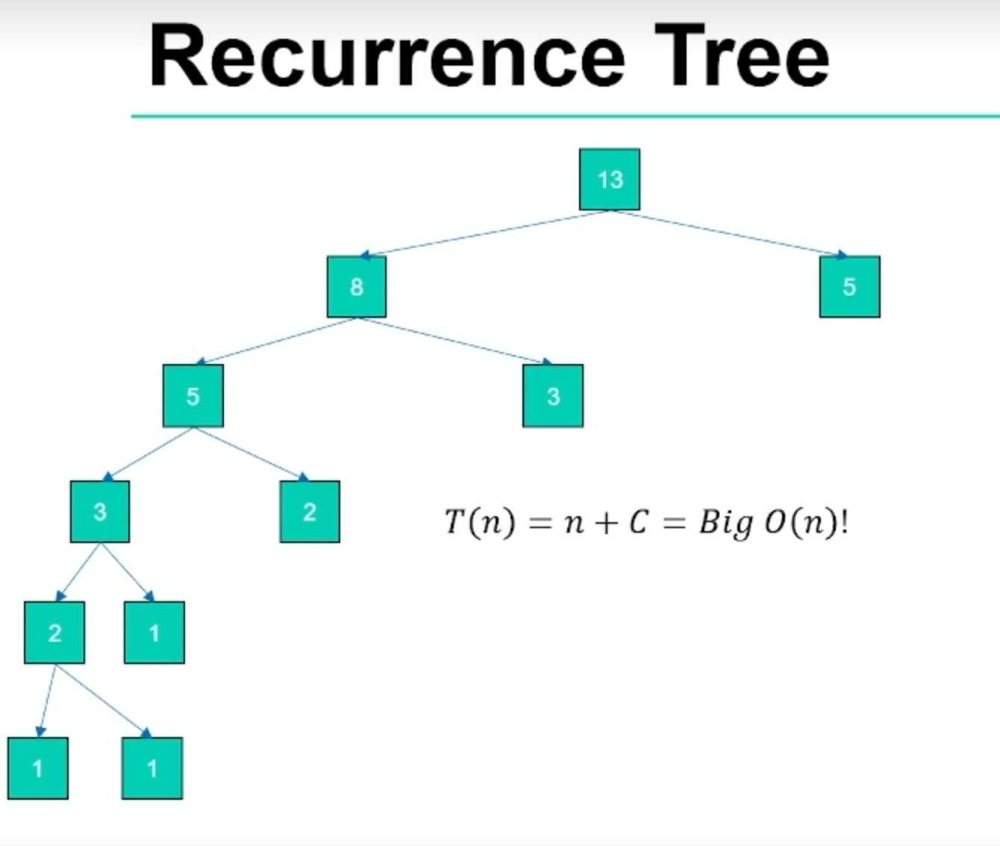
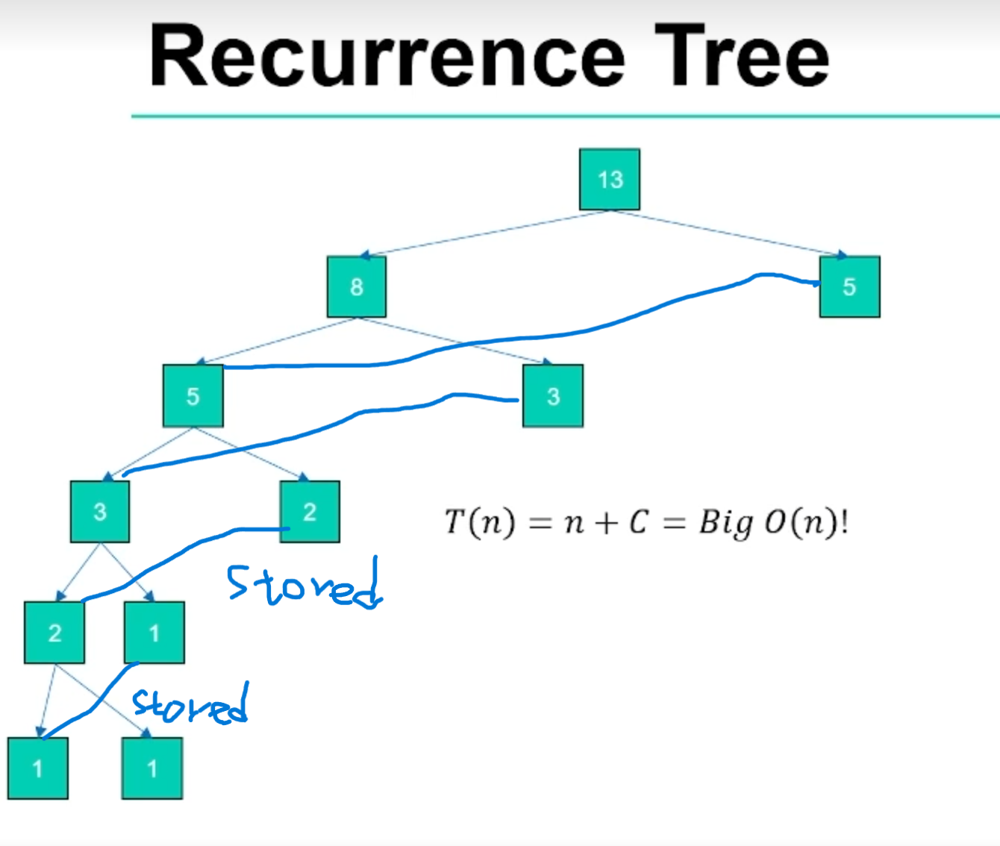

[](https://classroom.github.com/a/kdfTwECC)
# Midterm p1: Report on Analysis of Fibonacci  Series
* **Author**: Haisheng Shi
* **GitHub Repo**: https://github.com/CS5008Fall2025/midterm-report-shihai-ops
* **Semester**: Fall 2025
* **Languages Used**: c, Python

> You are free to rename/ modify these sections as you need (and don't forget to remove this line..)

## Overview
This report focuses on the speed differences between different implementations of the Fibonacci Series. It is worth mentioning that this sequence was popularized to the Western world by Leonardo of Pisa, or Fibonacci, in the early 13th century, but its concept appeared in Indian mathematics centuries ago.

The Fibonacci sequence is a sequence of integers in which each number is the sum of the two preceding numbers. Usually the first two terms F(0) = 0 and F(1) = 1 start. Its mathematical expression is: 

$$F_n = F_{n-1} + F_{n-2}$$

The first 10 numbers of the sequence as follows:0, 1, 1, 2, 3, 5, 8, 13, 21, 34...
There are many ways we can implement the Fibonacci sequence in code, which will be discussed in detail below. The algorithm complexity (Big O) for the various implementations used in this report is shown in the table below:
| Version |  Big O | Space Used | 
| :-- | :-- |  :-- |
| Iterative | $O(n)$ | $O(1)$ |
| Recursive | $O(2^n)$  | $O(n)$ |
| Dynamic Programming | $O(n)$ | $O(n)$ |

### Iterative version

The iterative version uses only one for loop, calculating each number from scratch, so the time complexity is O(n). It only needs to store the first two digits, so the spatial complexity is O(1). 
The pseudocode for the iterative method version is as follows:
```Plaintext
FUNCTION Fib_iter(n)
    IF n <= 1 THEN
        RETURN n
    END IF

    a ← 0
    b ← 1

    FOR i ← 2 TO n DO
        temp ← a + b
        a ← b
        b ← temp
    END FOR

    RETURN b
END FUNCTION
```
### Recursive version

The recursive version uses a recurrence tree as below:

 [1]


Since every division of the tree connects to two more divisions, the big O time complexity would be $O(2^n)$ . 
The pseudocode for the recursive version is as follows:
```Plaintext
Function Fib(n)
    if n <= 1: return n
    return Fib(n - 1) + Fib(n - 2)
```
To compute Fib(n), the function calls Fib(n-1) and Fib(n-2). These two calls each generate more calls, resulting in exponential increases in the number of calculations. This results in a time complexity of $O(2^n)$, but since the depth of the call stack is up to n, the spatial complexity is O(n).

### The dynamic planning version

The dynamic planning version uses a recurrence tree as below:

 [1]

Since the memorization technique reduced the duplicated calculation in the recursive version, the tree is reduced to only the left side. Hence, the program only goes over the tree once, leaving the time complexity to O(n). The result for each level of the tree is stored in memory. Hence, it requires a memory complexity of O(n) to store it.

 [1]


The dynamic planning version stores the calculation results for each Fib(i). When a value is needed again, it can be fetched directly from storage at constant time without recalculation. This effectively cuts out the duplicate recursive branches, reducing time complexity to O(n), and the result for each level of the tree is stored in memory; hence, it requires memory complexity of O(n) to store it. 
The pseudocode for the dynamic programming version is as follows:

r = array from [0..n]

n = nth fibonacci number
```markdown
FIBONACCI(n, r)
if r[n] != 0:
    return r[n]
if n <= 1
    r[n] = n
else
    r[n] = FIBONACCI(n-1, r) + FIBONACCI(n-2, r)
return r[n]
``` 
 [1]

For this analysis, I chose Python as my second language. Aside from being a well-known language, the main reason is that it provides auxiliary functions such as lru_cache and cache in the built-in FuncTools library, greatly simplifying the implementation of dynamic programming. Moreover, it is the language I am most familiar with. The Pandas package is an excellent tool in this program when drawing a statistical diagram. These characters make it easier for me to experiment with these built-in tools while using a language designed for rapid development and experimentation.

## Empirical Data & Discussion 

### Operations Comparsion
The way to count the operation number is by adding a counter to functions in each different programs. The counter will add 1 when every operation has been made, such as a loop run once, or the function itself has been called once. 

The first 40 rows of the triangle are shown in the chart below. If I set n > 40, the time consumed by the recursive method is very significant. Since it has an exponential growth in time complexity. 


#### Operation Count
[ops_fib_c_results.csv](ops_fib_c_results.csv)

## Language Analysis


### Language 1: C


### Language 2: UPDATE


### Comparison and Discussion Between Experiences


## Conclusions / Reflection

## References
[1] Northeastern University. n.d. Memoization Example: Fibonacci Sequence (7–10). Retrieved October 19, 2025 from https://northeastern.instructure.com/courses/225849/pages/memoization-example-fibonacci-sequence-7-10?module_item_id=12387024
