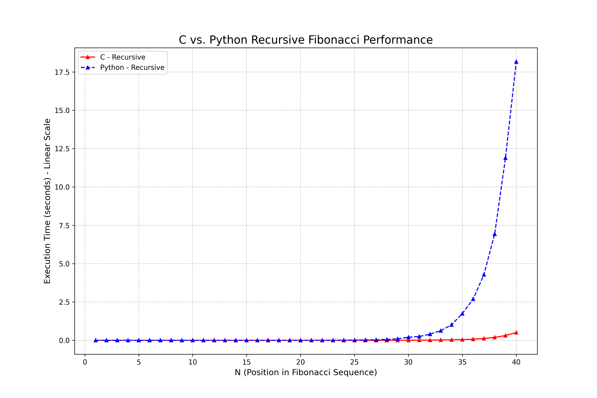
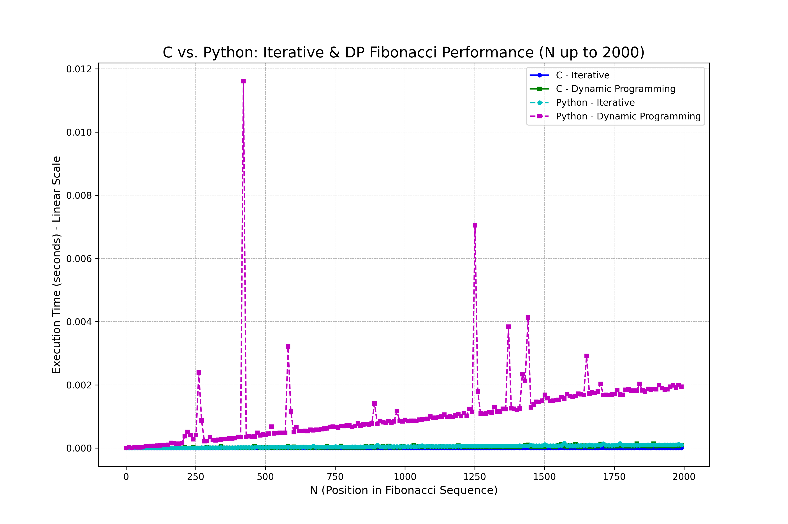

[](https://classroom.github.com/a/kdfTwECC)
# Midterm p1: Report on Analysis of Fibonacci  Series
* **Author**: Haisheng Shi
* **GitHub Repo**: https://github.com/CS5008Fall2025/midterm-report-shihai-ops
* **Semester**: Fall 2025
* **Languages Used**: c, Python


## Overview
This report focuses on the speed differences between different implementations of the Fibonacci Series. It is worth mentioning that this sequence was popularized to the Western world by Leonardo of Pisa, or Fibonacci, in the early 13th century, but its concept appeared in Indian mathematics centuries ago.

The Fibonacci sequence is a sequence of integers in which each number is the sum of the two preceding numbers. Usually the first two terms F(0) = 0 and F(1) = 1 start. Its mathematical expression is: 

$$F_n = F_{n-1} + F_{n-2}$$

The first 10 numbers of the sequence as follows:0, 1, 1, 2, 3, 5, 8, 13, 21, 34...
There are many ways we can implement the Fibonacci sequence in code, which will be discussed in detail below. The algorithm complexity (Big O) for the various implementations used in this report is shown in the table below:
| Version |  Big O | Space Used | 
| :-- | :-- |  :-- |
| Iterative | $O(n)$ | $O(1)$ |
| Recursive | $O(2^n)$  | $O(n)$ |
| Dynamic Programming | $O(n)$ | $O(n)$ |

### Iterative version

The iterative version uses only one for loop, calculating each number from scratch, so the time complexity is O(n). It only needs to store the first two digits, so the spatial complexity is O(1). 
The pseudocode for the iterative method version is as follows:
```Plaintext
FUNCTION Fib_iter(n)
    IF n <= 1 THEN
        RETURN n
    END IF

    a ← 0
    b ← 1

    FOR i ← 2 TO n DO
        temp ← a + b
        a ← b
        b ← temp
    END FOR

    RETURN b
END FUNCTION
```
### Recursive version

The recursive version uses a recurrence tree as below:

 [1]


Since every division of the tree connects to two more divisions, the big O time complexity would be $O(2^n)$ . 
The pseudocode for the recursive version is as follows:
```Plaintext
Function Fib(n)
    if n <= 1: return n
    return Fib(n - 1) + Fib(n - 2)
```
To compute Fib(n), the function calls Fib(n-1) and Fib(n-2). These two calls each generate more calls, resulting in exponential increases in the number of calculations. This results in a time complexity of $O(2^n)$, but since the depth of the call stack is up to n, the spatial complexity is O(n).

### The dynamic planning version

The dynamic planning version uses a recurrence tree as below: 

 [1]

Since the memorization technique reduced the duplicated calculation in the recursive version, the tree is reduced to only the left side. Hence, the program only goes over the tree once, leaving the time complexity to O(n). The result for each level of the tree is stored in memory. Hence, it requires a memory complexity of O(n) to store it.

 [1]


The dynamic planning version stores the calculation results for each Fib(i). When a value is needed again, it can be fetched directly from storage at constant time without recalculation. This effectively cuts out the duplicate recursive branches, reducing time complexity to O(n), and the result for each level of the tree is stored in memory; hence, it requires memory complexity of O(n) to store it. 
The pseudocode for the dynamic programming version is as follows:

r = array from [0..n]

n = nth fibonacci number
```markdown
FIBONACCI(n, r)
if r[n] != 0:
    return r[n]
if n <= 1
    r[n] = n
else
    r[n] = FIBONACCI(n-1, r) + FIBONACCI(n-2, r)
return r[n]
``` 
 [1]

For this analysis, I chose Python as my second language. Aside from being a well-known language, the main reason is that it provides auxiliary functions such as lru_cache and cache in the built-in FuncTools library, greatly simplifying the implementation of dynamic programming. Moreover, it is the language I am most familiar with. The Pandas package is an excellent tool in this program when drawing a statistical diagram. These characters make it easier for me to experiment with these built-in tools while using a language designed for rapid development and experimentation.

## Empirical Data & Discussion 
The text script is used the same test script provided in the example project. [test script](test_runner.py).

### Operations Comparsion
The way to count the operation number is by adding a counter to functions in each different programs. The counter will add 1 when every operation has been made, such as a loop run once, or the function itself has been called once. 

The first 40 rows of the triangle are shown in the chart below. If I set n > 40, the time consumed by the recursive method is very significant. Since it has an exponential growth in time complexity. The operation counts are the same in both C and Python. 


#### Operation Count
| **N** | **Iterative** | **Dynamic Programming** | **Recursive** |
|---:|---:|---:|---:|
| 1 | 0 | 0 | 0 |
| 2 | 1 | 1 | 1 |
| 3 | 2 | 2 | 2 |
| 4 | 3 | 3 | 4 |
| 5 | 4 | 4 | 7 |
| 6 | 5 | 5 | 12 |
| 7 | 6 | 6 | 20 |
| 8 | 7 | 7 | 33 |
| 9 | 8 | 8 | 54 |
| 10 | 9 | 9 | 88 |
| 11 | 10 | 10 | 143 |
| 12 | 11 | 11 | 232 |
| 13 | 12 | 12 | 376 |
| 14 | 13 | 13 | 609 |
| 15 | 14 | 14 | 986 |
| 16 | 15 | 15 | 1596 |
| 17 | 16 | 16 | 2583 |
| 18 | 17 | 17 | 4180 |
| 19 | 18 | 18 | 6764 |
| 20 | 19 | 19 | 10945 |
| 21 | 20 | 20 | 17710 |
| 22 | 21 | 21 | 28657 |
| 23 | 22 | 22 | 46368 |
| 24 | 23 | 23 | 75025 |
| 25 | 24 | 24 | 121393 |
| 26 | 25 | 25 | 196418 |
| 27 | 26 | 26 | 317811 |
| 28 | 27 | 27 | 514229 |
| 29 | 28 | 28 | 832040 |
| 30 | 29 | 29 | 1346269 |
| 31 | 30 | 30 | 2178309 |
| 32 | 31 | 31 | 3524578 |
| 33 | 32 | 32 | 5702887 |
| 34 | 33 | 33 | 9227465 |
| 35 | 34 | 34 | 14930352 |
| 36 | 35 | 35 | 24157817 |
| 37 | 36 | 36 | 39088169 |
| 38 | 37 | 37 | 63245986 |
| 39 | 38 | 38 | 102334155 |
| 40 | 39 | 39 | 165580141 |
### Recursive Versions
The recursive version is the only version which runs at the time complexity of $O(2^n)$. 
 As the diagram shows the C is significantly faster than Python. (n = 40)

### Iterative and Dynamic Programming Versions
After N>40, there is no data being tested on the Recursive method since the time complexity grows exponentially. 
You can see Python is slower than C, and the Dynamic Programming is slightly slower than the Iterative method. The Python run time jumps for several times is probably because I run Python in WSL VM which is not very stable when performing multi tasks. 
## Language Analysis
The code writing files are shown below:
* [fibonacci.c](fibonacci.c)  -- implements fibonacci in C. 
* [fibonacci.py](fibonacci.py)    -- implements fibonacci in python. 
* [test_runner.py](test_runner.py)    -- check ogs and timings and output to .csv

C is always faster than Python in all cases in this project, but the difference is not significant compared to the different method you use to solve the Fibonacci sequence. 

C is a very challenging language. The data type, structs, and pointers, and heaps are very unfriendly to new learners.  Meanwhile, Python is much easier to get hands-on with new algorithms learned. I am more familiar with Python, so I always try to code with Python first, with pseudo-code provided by the lecturer. Once the Python version is done correctly, I will begin to work on the C version. 

### Language 1: C
There are numerous problems with my coding. One of the hardest one during my coding is typedef uint64_t ull where the uint64_t in Windows is long long, while in Linux it is Long. I am compiling my code in WSL(Windows Subsystem for Linux) as I failed to install the C compiler in the Windows environment. When coding in Windows, the IDE won't show the error of the code, but it cannot compile in Linux environment. I have to change the format specifier to %lu, but this is not correct in Windows; however, it works in Linux. 

### Language 2: Python


### Comparison and Discussion Between Experiences


## Conclusions / Reflection

## References
[1] Northeastern University. n.d. Memoization Example: Fibonacci Sequence (7–10). Retrieved October 19, 2025 from https://northeastern.instructure.com/courses/225849/pages/memoization-example-fibonacci-sequence-7-10?module_item_id=12387024
